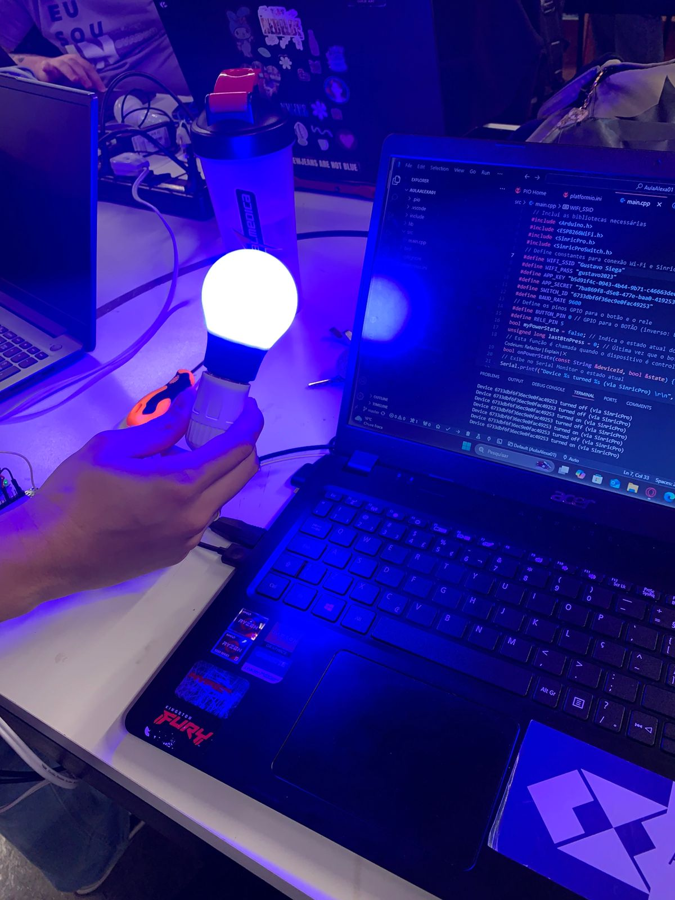

# Integração Alexa

Este projeto configura um ESP8266 para se conectar a uma rede Wi-Fi e ser controlado remotamente via a plataforma SinricPro. Ele permite ligar ou desligar uma lâmpada tanto através de comandos online quanto fisicamente por meio de um botão. Este README detalha as principais funcionalidades e a estrutura do código.

## Descrição das Funcionalidades

1. **Conexão Wi-Fi**:

   - O ESP8266 se conecta a uma rede Wi-Fi usando o SSID e a senha fornecidos.
   - A função `setupWiFi` gerencia o processo de conexão, exibindo o endereço IP assim que o dispositivo se conecta.

2. **Integração com SinricPro**:

   - O código utiliza a plataforma SinricPro para permitir o controle remoto do dispositivo.
   - A função `onPowerState` recebe o comando de ligar/desligar do SinricPro e ajusta o estado do dispositivo (relé) conforme o comando.

3. **Controle Manual via Botão**:
   - O código permite ligar e desligar o dispositivo manualmente através de um botão.
   - A função `handleButtonPress` verifica se o botão foi pressionado e, se sim, alterna o estado do dispositivo. Esse estado também é atualizado no servidor SinricPro.

## Objetivo e Utilização

Este projeto é ideal para automação de dispositivos, permitindo controle remoto e físico. Um uso comum é em sistemas de iluminação ou controle de eletrodomésticos, possibilitando que o usuário ligue e desligue o dispositivo remotamente.

## Requisitos

- **ESP8266**
- **Conta SinricPro**
- **Rede Wi-Fi**
- **IDE Arduino**
- **Lâmpada**
- **Relé**
- **Fio de Energia**
- **Cabo Macho**

## Configuração do Código

1. **Bibliotecas Necessárias**:

   ```cpp
   #include <ESP8266WiFi.h>
   #include <SinricPro.h>
   #include <SinricProSwitch.h>
   ```

   Essas bibliotecas permitem a conexão com Wi-Fi e a integração com a API SinricPro.

2. **Credenciais de Rede e SinricPro**:

   - Defina o nome e a senha da rede Wi-Fi, bem como as chaves `APP_KEY`, `APP_SECRET` e `SWITCH_ID` obtidas no SinricPro.

   ```cpp
   #define WIFI_SSID "Nome_da_Rede"
   #define WIFI_PASS "Senha_da_Rede"
   #define APP_KEY "sua_app_key"
   #define APP_SECRET "seu_app_secret"
   #define SWITCH_ID "seu_switch_id"
   ```

## Detalhamento do Código

### Conexão Wi-Fi

A função `setupWiFi` realiza a conexão do ESP8266 com a rede Wi-Fi e exibe o endereço IP no monitor serial ao estabelecer a conexão.

```cpp
void setupWiFi() {
  Serial.printf("\r\n[WiFi]: Connecting");
  WiFi.begin(WIFI_SSID, WIFI_PASS);
  while (WiFi.status() != WL_CONNECTED) {
    Serial.printf(".");
    delay(250);
  }
  Serial.printf("connected!\r\n[WiFi]: IP-Address is %s\r\n", WiFi.localIP().toString().c_str());
}
```

### Configuração SinricPro

A função `setupSinricPro` inicializa a conexão com o SinricPro e define os callbacks para controlar o dispositivo via comandos remotos.

```cpp
void setupSinricPro() {
  SinricProSwitch& mySwitch = SinricPro[SWITCH_ID];
  mySwitch.onPowerState(onPowerState);
  SinricPro.onConnected([](){ Serial.printf("Connected to SinricPro\r\n"); });
  SinricPro.onDisconnected([](){ Serial.printf("Disconnected from SinricPro\r\n"); });
  SinricPro.begin(APP_KEY, APP_SECRET);
}
```

### Controle Manual (Botão)

A função `handleButtonPress` lida com a pressão do botão físico, alternando o estado do dispositivo e enviando o novo estado para o SinricPro.

```cpp
void handleButtonPress() {
  unsigned long actualMillis = millis();
  if (digitalRead(BUTTON_PIN) == LOW && actualMillis - lastBtnPress > 1000) {
    myPowerState = !myPowerState;
    digitalWrite(RELE_PIN, myPowerState ? LOW : HIGH);
    SinricProSwitch& mySwitch = SinricPro[SWITCH_ID];
    mySwitch.sendPowerStateEvent(myPowerState);
    lastBtnPress = actualMillis;
  }
}
```

## Estrutura do Código

1. **setup()**:

   - Configura os pinos para o botão e o relé.
   - Inicializa a conexão serial e configura o Wi-Fi e o SinricPro.

2. **loop()**:
   - Chamadas para `handleButtonPress()` e `SinricPro.handle()` são feitas para monitorar o botão e gerenciar os comandos da plataforma SinricPro.

```cpp
void loop() {
  handleButtonPress();
  SinricPro.handle();
}
```

## Considerações Finais

Esse projeto é uma implementação básica para controle remoto e local de dispositivos com ESP8266, ideal para automação residencial. Ele permite que o usuário alterne facilmente entre o controle remoto e o físico, garantindo flexibilidade e conveniência na operação.

## Arquitetura

<p align="center">
  
</p>

## Imagens do Desenvolvimento do Projeto

<p align="center">
  
</p>
